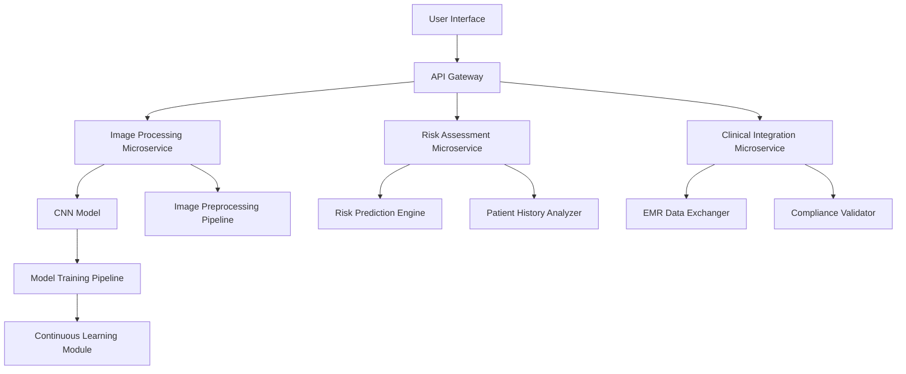

# System Architecture - Detailed Technical Design

## Architectural Overview

### Design Principles
- Modularity
- Scalability
- High Performance
- Secure Data Handling

### Component Interaction Diagram

## Microservices Architecture

### 1. Image Processing Microservice
- **Responsibilities**
  - Image preprocessing
  - Wound classification
  - Feature extraction

- **Key Components**
  1. Preprocessing Pipeline
     - Normalization
     - Augmentation
     - Standardization
  
  2. CNN Classification Model
     - 10 Wound Type Detection
     - Transfer Learning
     - Multi-stage Classification

- **Performance Targets**
  - Inference Time: < 100ms
  - Accuracy: 85%+
  - Preprocessing Variations: 50+

### 2. Risk Assessment Microservice
- **Responsibilities**
  - Probabilistic risk modeling
  - Patient history analysis
  - Predictive risk scoring

- **Key Components**
  1. Risk Prediction Engine
     - Machine Learning Algorithms
     - Bayesian Probabilistic Modeling
     - Continuous Learning

  2. Patient History Analyzer
     - Data Integration
     - Historical Risk Factors
     - Contextual Risk Assessment

- **Performance Targets**
  - Risk Prediction Accuracy: 90%
  - Real-time Processing
  - Interpretable Results

### 3. Clinical Integration Microservice
- **Responsibilities**
  - EMR Data Exchange
  - Compliance Validation
  - Secure Communication

- **Key Components**
  1. EMR Data Exchanger
     - HL7/FHIR Compatibility
     - Bidirectional Data Sync
     - Standardized Medical Protocols

  2. Compliance Validator
     - HIPAA Compliance Checks
     - GDPR Data Protection
     - Encryption Mechanisms

- **Security Features**
  - End-to-End Encryption
  - Anonymized Data Handling
  - Audit Trail Logging

## Infrastructure Design

### Deployment Architecture
- **Containerization**: Docker
- **Orchestration**: Kubernetes
- **Scaling**: Horizontal Pod Autoscaling
- **High Availability**: Multi-zone Deployment

### Data Management
- **Primary Database**: PostgreSQL
- **Caching Layer**: Redis
- **Data Storage**: Distributed File Systems

## Model Training Infrastructure

### Continuous Learning Framework
- **Model Retraining**
  - Periodic Performance Evaluation
  - Automated Retraining Triggers
  - Version Control for Models

- **Transfer Learning**
  - Domain-Specific Fine-Tuning
  - Incremental Model Improvements
  - Adaptive Learning Rates

### Bias Mitigation Strategies
- Diverse Training Datasets
- Algorithmic Fairness Checks
- Regular Model Auditing
- Interpretability Layers

## Communication Protocols
- **API Gateway**: Secure RESTful Endpoints
- **WebSocket**: Real-time Updates
- **gRPC**: High-Performance Inter-service Communication

## Monitoring and Observability
- **Metrics**: Prometheus
- **Logging**: ELK Stack
- **Error Tracking**: Sentry
- **Performance Visualization**: Grafana

## Compliance and Ethical Considerations
- Medical Data Privacy
- Algorithmic Transparency
- Continuous Ethical Auditing
- Patient Consent Mechanisms

## Future Scalability Considerations
- Serverless Computing Integration
- Edge AI Deployment
- Advanced Multi-modal Learning
- Global Healthcare Standardization
