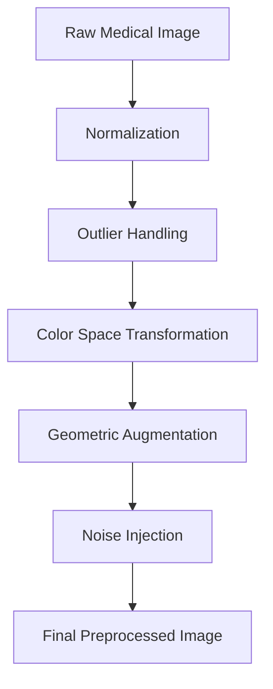

# Data Processing Pipeline - Technical Specification

## Overview
Comprehensive image preprocessing and augmentation framework for medical image analysis in Pressure Injury Detection.

## Preprocessing Workflow



## Detailed Processing Stages

### 1. Normalization Techniques
- **Z-Score Normalization**
  - Channel-wise standardization
  - Mean subtraction
  - Standard deviation scaling

- **Scaling Methods**
  - Min-Max scaling to [0, 1]
  - Robust scaling with outlier protection

### 2. Outlier Handling
- **Statistical Techniques**
  - Interquartile Range (IQR) method
  - Z-score based clipping
  - Winsorization

- **Robust Transformation**
  - Preserve image information
  - Reduce extreme value impact
  - Maintain statistical properties

### 3. Color Space Transformation
- **Color Normalization**
  - RGB to grayscale conversion
  - Contrast Limited Adaptive Histogram Equalization (CLAHE)
  - Color space invariance techniques

### 4. Geometric Augmentation
- **Transformation Types**
  1. Rotations
     - 0°, 45°, 90°, 135°, 180° angles
     - Random rotation within range
  
  2. Flips
     - Horizontal mirroring
     - Vertical mirroring
  
  3. Scaling
     - Uniform and non-uniform scaling
     - Aspect ratio preservation

### 5. Noise Injection
- **Noise Models**
  - Gaussian noise
  - Salt and pepper noise
  - Poisson noise
  - Speckle noise

- **Noise Injection Strategies**
  - Controlled noise level
  - Adaptive noise generation
  - Preserving image semantics

## Augmentation Configuration

### Augmentation Probability Matrix
```python
augmentation_config = {
    "rotation_prob": 0.7,
    "flip_prob": 0.5,
    "noise_prob": 0.3,
    "max_rotation_angle": 45,
    "noise_intensity": [0.01, 0.05]
}
```

## Performance Metrics

### Augmentation Effectiveness
- **Diversity Metrics**
  - Unique transformed images
  - Variation in image characteristics
  - Semantic preservation

- **Model Performance Impact**
  - Accuracy improvement
  - Generalization capability
  - Robustness to variations

## Implementation Details

### Python Implementation Snippet
```python
class MedicalImagePreprocessor:
    def __init__(self, config):
        self.config = config
    
    def preprocess(self, image):
        # Normalization
        normalized = self.normalize(image)
        
        # Augmentation
        augmented = self.augment(normalized)
        
        return augmented
    
    def normalize(self, image):
        # Z-score normalization
        return (image - np.mean(image)) / np.std(image)
    
    def augment(self, image):
        # Random augmentation pipeline
        if random.random() < self.config['rotation_prob']:
            image = self.rotate(image)
        
        if random.random() < self.config['flip_prob']:
            image = self.flip(image)
        
        if random.random() < self.config['noise_prob']:
            image = self.add_noise(image)
        
        return image
```

## Ethical Considerations
- Preserve medical image integrity
- Maintain diagnostic information
- Avoid introducing artifacts
- Ensure reproducibility

## Future Improvements
- Advanced generative augmentation
- Domain-specific transformation techniques
- Adaptive augmentation strategies
- Integration with transfer learning
