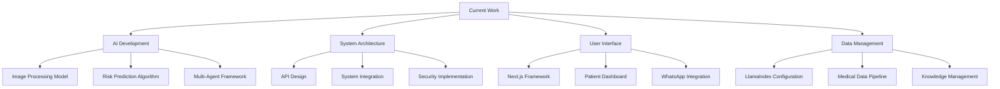

# Active Project Context

## Current Work Streams

## Detailed Work Tracking

### AI Development

| Task | Owner | Start Date | End Date | Progress | Details |
|------|-------|------------|----------|----------|---------|
| CNN Architecture | AI Team | 2025-02-16 | 2025-03-31 | 75% | Implementing ResNet50 backbone |
| Risk Prediction | AI Team | 2025-03-01 | 2025-04-15 | 40% | Developing multi-agent framework |
| Model Training | AI Team | 2025-03-15 | 2025-05-15 | 20% | Preparing training pipeline |

### System Architecture

| Task | Owner | Start Date | End Date | Progress | Details |
|------|-------|------------|----------|----------|---------|
| API Design | Backend Team | 2025-02-20 | 2025-03-15 | 60% | Defining REST endpoints |
| Security Implementation | DevOps | 2025-03-01 | 2025-03-31 | 30% | Implementing OAuth2 |
| System Integration | DevOps | 2025-03-15 | 2025-04-30 | 10% | Planning integration strategy |

### User Interface

| Task | Owner | Start Date | End Date | Progress | Details |
|------|-------|------------|----------|----------|---------|
| Next.js Setup | Frontend Team | 2025-02-25 | 2025-03-10 | 90% | Core framework implemented |
| Patient Dashboard | Frontend Team | 2025-03-01 | 2025-04-15 | 40% | Building core components |
| WhatsApp Integration | Frontend Team | 2025-03-10 | 2025-04-30 | 20% | Researching API capabilities |

### Data Management

| Task | Owner | Start Date | End Date | Progress | Details |
|------|-------|------------|----------|----------|---------|
| LlamaIndex Configuration | Data Team | 2025-02-28 | 2025-03-20 | 50% | Setting up knowledge graphs |
| Medical Data Pipeline | Data Team | 2025-03-01 | 2025-04-15 | 30% | Designing ETL processes |
| Knowledge Management | Data Team | 2025-03-05 | 2025-04-30 | 20% | Implementing retrieval systems |

## Recent Changes

| Date | Change | Impact | Details |
|------|--------|--------|---------|
| 2025-03-01 | Adopted LlamaIndex | High | Improved knowledge management capabilities |
| 2025-02-28 | Implemented Multi-Agent Architecture | Critical | Enhanced system flexibility and scalability |
| 2025-02-25 | Added WhatsApp Integration | Medium | Expanded patient communication channels |

## Key Decisions

| Decision | Date | Owner | Rationale |
|----------|------|-------|-----------|
| Use Next.js | 2025-02-15 | Team | Modern framework with SSR capabilities |
| Implement CNN | 2025-02-20 | AI Team | Best for medical image analysis |
| Multi-Agent System | 2025-02-25 | AI Team | Enables specialized task handling |

## Related Files

- progress.md: Detailed project timeline
- techContext.md: Technical specifications
- systemPatterns.md: Architecture details
