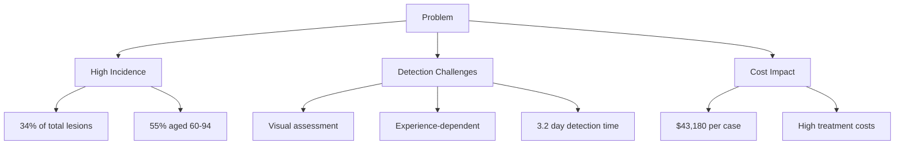
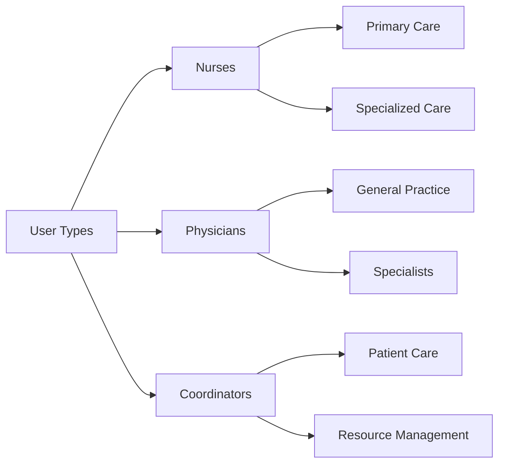
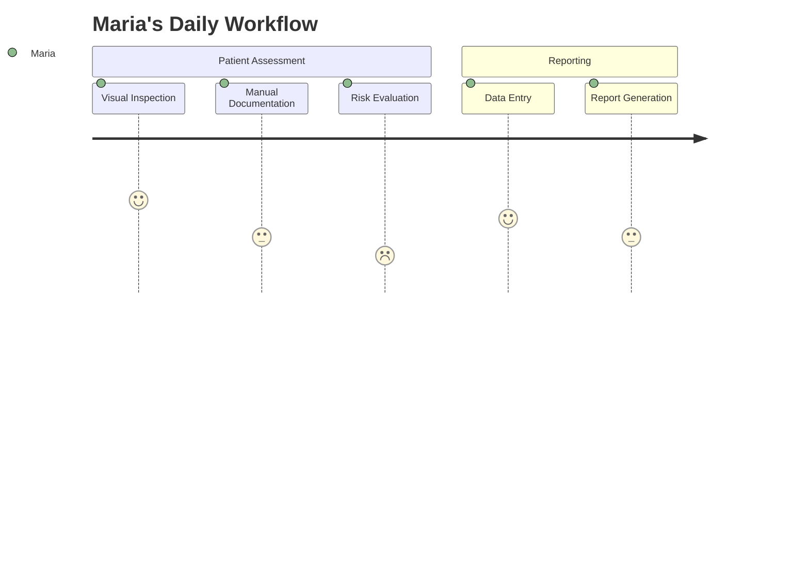
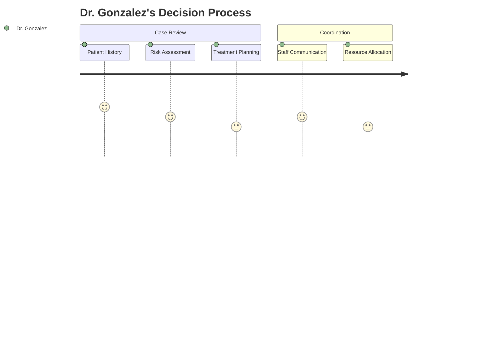
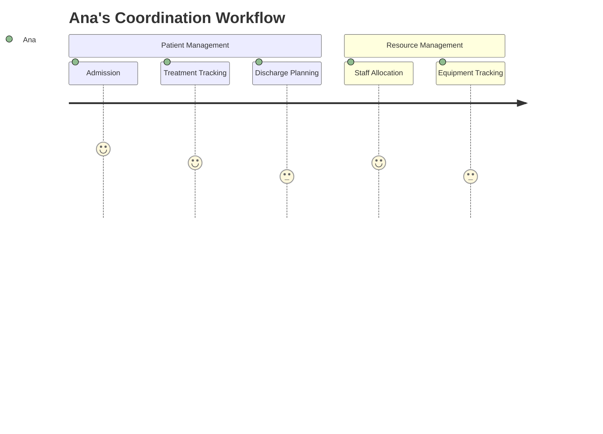
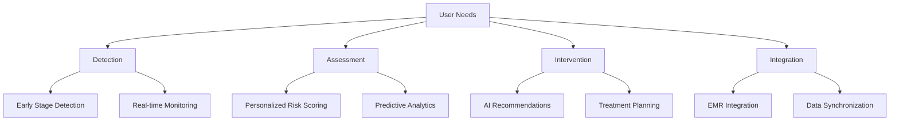
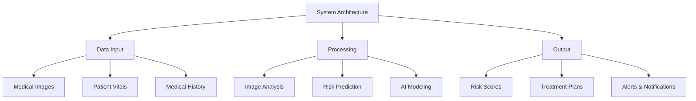
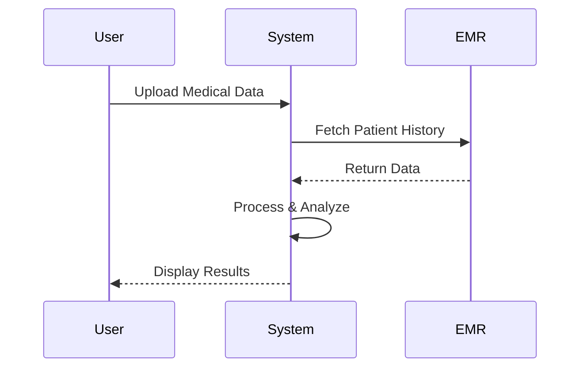
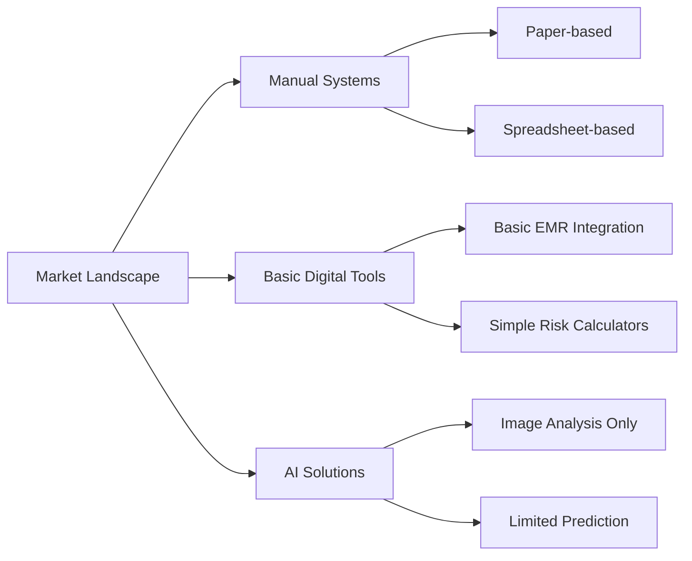

# Product Context: LPP Detection Solution

## Problem Statement



### Key Statistics

| Metric | Value | Impact |
|--------|-------|--------|
| Incidence Rate | 34% | High prevalence |
| Elderly Patients | 55% | Focus demographic |
| Detection Time | 3.2 days | Delayed treatment |
| Treatment Cost | $43,180 | Significant financial burden |

### Root Cause Analysis

1. Manual assessment processes
2. Lack of early detection tools
3. Inconsistent risk evaluation methods
4. Limited integration with EMR systems

## User Personas



### Detailed Personas

#### 1. Maria Gonzalez - Primary Nurse



**Key Attributes**

- Role: Primary Care Nurse
- Age: 32
- Experience: 8 years
- Tech Proficiency: Medium
- Daily Patients: 15-20

**Pain Points**

- Time-consuming manual documentation
- Inconsistent risk evaluation methods
- Limited decision support tools

#### 2. Dr. Carlos Gonzalez - Head Physician



**Key Attributes**

- Role: Chief Medical Officer
- Age: 45
- Experience: 18 years
- Tech Proficiency: High
- Daily Cases: 30-40

**Pain Points**

- Delayed intervention due to reporting lag
- Incomplete patient risk profiles
- Limited predictive analytics

#### 3. Ana Ramirez - Patient Care Coordinator



**Key Attributes**

- Role: Patient Care Coordinator
- Age: 38
- Experience: 10 years
- Tech Proficiency: Medium
- Daily Patients: 50-60

**Pain Points**

- Manual data entry errors
- Resource allocation challenges
- Coordination bottlenecks

## User Needs



### Functional Requirements

1. **Detection System**
   - Identify Stage 1 pressure injuries with 95% accuracy
   - Provide real-time monitoring alerts
   - Support multi-modal data input (images, vitals, patient history)

2. **Risk Assessment**
   - Generate personalized risk scores
   - Incorporate predictive analytics
   - Provide visual risk progression charts

3. **Intervention Support**
   - Suggest evidence-based treatment plans
   - Provide AI-driven recommendations
   - Track treatment effectiveness

4. **System Integration**
   - Seamless EMR integration
   - Real-time data synchronization
   - Role-based access control

### Non-Functional Requirements

| Category | Requirement | Target |
|----------|-------------|--------|
| Performance | Response Time | < 2 seconds |
| Availability | Uptime | 99.9% |
| Security | Data Encryption | AES-256 |
| Scalability | Concurrent Users | 500+ |
| Usability | Training Time | < 1 hour |

### Acceptance Criteria

1. Detection Accuracy
   - Stage 1 detection accuracy ≥ 95%
   - False positive rate < 5%

2. System Performance
   - Average response time < 2 seconds
   - Uptime ≥ 99.9%

3. User Satisfaction
   - 90% user satisfaction rate
   - 95% recommendation acceptance rate

4. Integration
   - Full EMR integration within 3 months
   - Data synchronization latency < 1 minute

## Related Files

- systemPatterns.md: System architecture and data flow
- techContext.md: AI model specifications and integration details
- progress.md: Current implementation status and milestones

## Solution Overview



### Technical Specifications

1. **Core Components**
   - Image Processing Engine
   - Predictive Analytics Module
   - Recommendation System
   - Integration Layer

2. **Data Flow**



3. **Key Features**
   - Real-time image analysis
   - Predictive risk scoring
   - Automated treatment suggestions
   - Integration with hospital systems

4. **Technology Stack**
   - Frontend: React.js
   - Backend: Node.js
   - AI Framework: TensorFlow
   - Database: PostgreSQL
   - Integration: HL7/FHIR

### Development Roadmap

| Phase | Duration | Milestones |
|-------|----------|------------|
| 1 | 3 months | Core architecture, basic image analysis |
| 2 | 2 months | Risk prediction models, UI development |
| 3 | 2 months | EMR integration, testing |
| 4 | 1 month | Deployment, training |

## Target Users

### User Personas

1. Dr. Maria Gonzalez (45)
   - Chief of Nursing, Quilpué Hospital
   - Needs: Streamline patient monitoring, reduce staff workload
2. Nurse Carlos Fernandez (32)
   - Wound care specialist
   - Needs: Accurate early detection, clear intervention guidance
3. Sofia Ramirez (68)
   - Caregiver for elderly mother
   - Needs: Easy-to-understand risk assessments, prevention tips

## Key Performance Indicators

- 90% user satisfaction rate
- 50% reduction in manual screening time
- 95% system recommendation acceptance rate
- 30% improvement in early detection rates

## Competitive Analysis



### Feature Comparison

| Feature | Our Solution | Competitor A | Competitor B |
|---------|--------------|--------------|--------------|
| AI Image Analysis | ✔️ | ✔️ | ✖️ |
| Risk Prediction | ✔️ | ✖️ | ✖️ |
| Multi-modal Data | ✔️ | ✖️ | ✖️ |
| EMR Integration | ✔️ | ✔️ | ✖️ |
| Real-time Alerts | ✔️ | ✖️ | ✖️ |
| Treatment Plans | ✔️ | ✖️ | ✖️ |

### Market Positioning

```mermaid
quadrantChart
    title Market Positioning
    x-axis "Technical Sophistication" --> "Low" --> "High"
    y-axis "Clinical Impact" --> "Low" --> "High"
    quadrant-1 "Innovators"
    quadrant-2 "Differentiators"
    quadrant-3 "Basic Solutions"
    quadrant-4 "Niche Players"
    
    Our Solution: [0.8, 0.9]
    Competitor A: [0.6, 0.4]
    Competitor B: [0.3, 0.2]
```

### SWOT Analysis

**Strengths**

- Comprehensive AI capabilities
- Multi-modal data integration
- Real-time decision support

**Weaknesses**

- Higher implementation cost
- Requires staff training
- Dependent on data quality

**Opportunities**

- Growing demand for AI in healthcare
- Potential for hospital-wide deployment
- Expansion to other wound care areas

**Threats**

- Regulatory challenges
- Data privacy concerns
- Competition from established players

### Market Trends

1. Increasing adoption of AI in healthcare
2. Growing focus on preventive care
3. Rising demand for integrated solutions
4. Shift towards value-based care models

## Related Files

- projectbrief.md: High-level project overview
- activeContext.md: Current development focus
