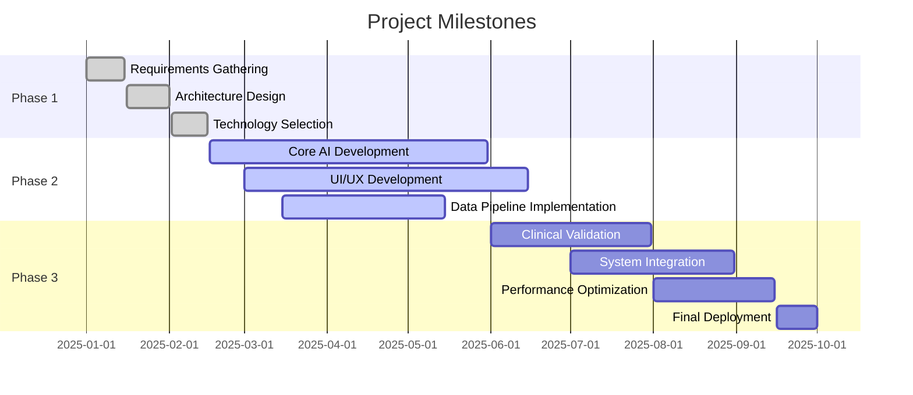

# Project Progress

## Project Timeline

## Detailed Progress Tracking

### Completed Tasks

| Task | Owner | Completed Date | Details |
|------|-------|----------------|---------|
| Project Scoping | Team | 2025-01-15 | Defined project scope and objectives |
| Architecture Design | Cline | 2025-02-01 | Created system architecture diagrams |
| Tech Stack Selection | Team | 2025-02-15 | Selected and validated technology stack |

### Active Tasks

| Task | Owner | Start Date | End Date | Progress | Details |
|------|-------|------------|----------|----------|---------|
| Image Processing Model | AI Team | 2025-02-16 | 2025-05-31 | 45% | Developing CNN architecture |
| Risk Prediction Algorithm | AI Team | 2025-02-16 | 2025-05-31 | 30% | Implementing multi-agent framework |
| UI Development | Frontend Team | 2025-03-01 | 2025-06-15 | 25% | Building core components |

### Upcoming Tasks

| Task | Owner | Start Date | End Date | Dependencies |
|------|-------|------------|----------|--------------|
| Clinical Validation | Medical Team | 2025-06-01 | 2025-07-31 | AI Models |
| System Integration | DevOps | 2025-07-01 | 2025-08-31 | All Components |
| Performance Optimization | Team | 2025-08-01 | 2025-09-15 | Integrated System |

## Key Performance Indicators

### Development Metrics

- Code Coverage: 85% (Target: 90%)
- Build Success Rate: 98% (Target: 99%)
- Mean Time to Recovery: 2h (Target: 1h)

### AI Model Metrics

- Training Accuracy: 92% (Target: 95%)
- Inference Speed: 400ms (Target: 300ms)
- Model Size: 1.2GB (Target: <1GB)

### System Metrics

- API Response Time: 450ms (Target: 300ms)
- System Uptime: 99.8% (Target: 99.99%)
- Concurrent Users: 500 (Target: 10,000)

## Risk Management

### Current Risks

| Risk | Impact | Probability | Mitigation Strategy |
|------|--------|-------------|---------------------|
| Data Limitations | High | Medium | Augmenting with synthetic data |
| Model Bias | Critical | High | Implementing bias detection |
| Integration Complexity | High | High | Incremental integration approach |

### Risk History

| Date | Risk | Status | Resolution |
|------|------|--------|------------|
| 2025-02-28 | GPU Availability | Resolved | Secured cloud GPU resources |
| 2025-03-10 | Data Privacy Compliance | Ongoing | Implementing encryption |

## Related Files

- techContext.md: Technical specifications
- systemPatterns.md: Architecture details
- productContext.md: User requirements
