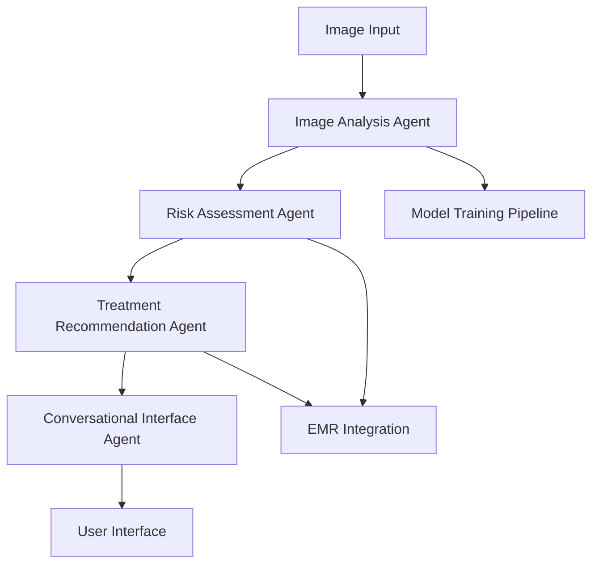
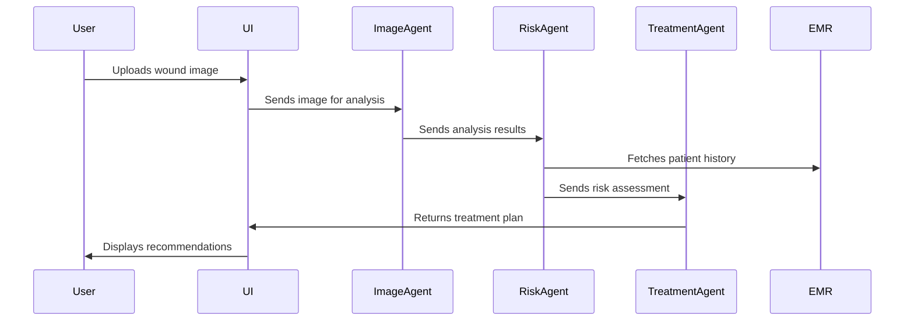

# System Architecture and Patterns

## Core Architecture

- Multi-agent AI system
- Modular design with specialized components
- Microservices-based approach
- RESTful APIs for external integrations
- Event-driven architecture using Kafka

## Key Components

### 1. Image Analysis Agent

- Deep learning model for wound detection
- Image preprocessing pipeline
- Feature extraction and classification
- Integration with hospital imaging systems

### 2. Risk Assessment Agent

- Predictive analytics engine
- Risk scoring algorithm
- Patient history integration
- Real-time risk monitoring

### 3. Treatment Recommendation Agent

- Evidence-based treatment protocols
- Personalized intervention plans
- Drug interaction checking
- Integration with pharmacy systems

### 4. Conversational Interface Agent

- Natural language processing
- Context-aware dialogue management
- Multi-language support
- Voice and text interfaces

## Communication Patterns

- Event-driven communication using Kafka
- Context-aware interactions
- Stateless design for scalability
- API Gateway for external access
- Message queues for asynchronous processing

## Data Flow

## Integration Points

1. Hospital EMR System
   - HL7/FHIR integration
   - Patient data synchronization
   - Treatment plan updates

2. Pharmacy Systems
   - Medication ordering
   - Drug interaction checking
   - Prescription tracking

3. Imaging Systems
   - DICOM integration
   - Image metadata extraction
   - Secure image transfer

## Related Files

- techContext.md: Technical specifications and dependencies
- productContext.md: User needs and solution overview
- progress.md: Implementation status and milestones
