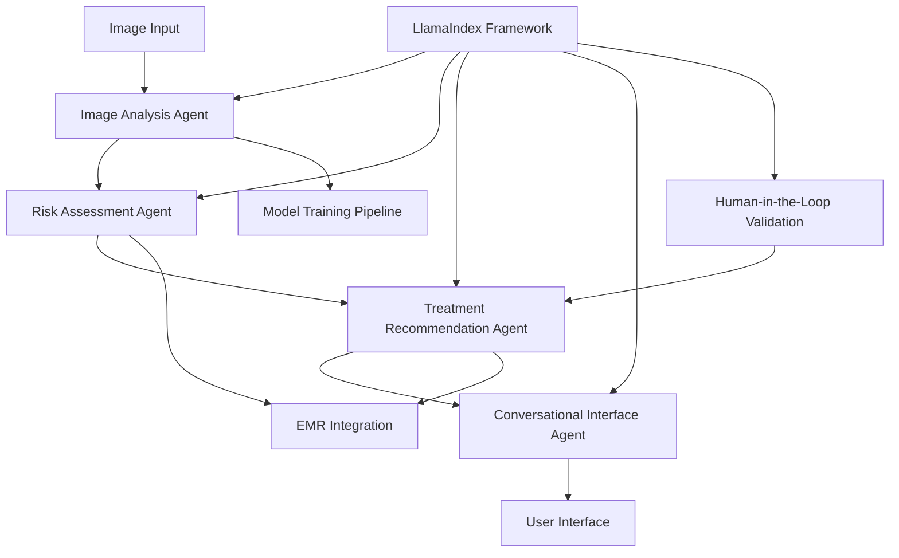
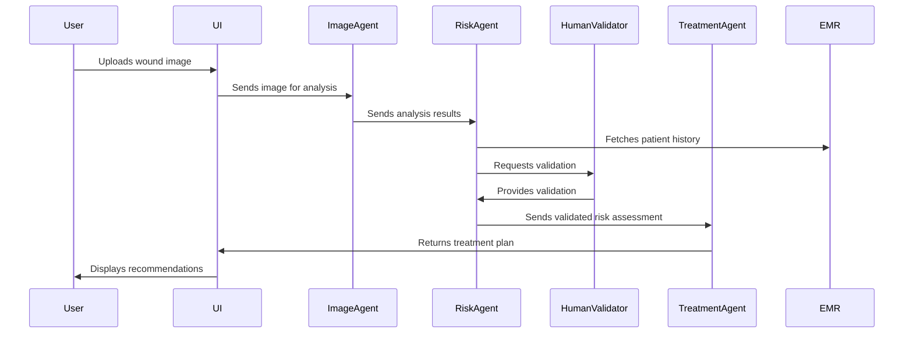
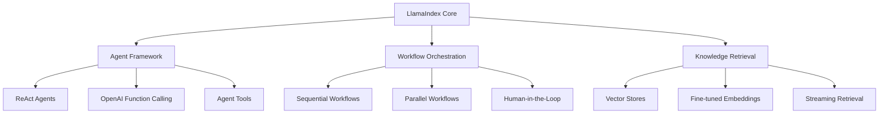

# System Architecture and Patterns

## Core Architecture



- Multi-agent AI system
- Modular design with specialized components
- Microservices-based approach
- RESTful APIs for external integrations
- Event-driven architecture using Kafka
- LlamaIndex-powered agent orchestration (New)
- Human-in-the-loop validation workflows (New)

## Key Components

### 1. Image Analysis Agent

- Deep learning model for wound detection
- Image preprocessing pipeline
- Feature extraction and classification
- Integration with hospital imaging systems
- Fine-tuned embeddings for medical images (New)

**Implementation with LlamaIndex (New)**:
```python
from llama_index import VectorStoreIndex, SimpleDirectoryReader
from llama_index.vector_stores import MetadataFilters, MetadataFilter
from llama_index.schema import ImageNode

# Crear índice de imágenes de heridas
documents = SimpleDirectoryReader("data/images/wound_classification").load_data()
image_nodes = [ImageNode(image_path=doc.image_path) for doc in documents]
index = VectorStoreIndex(image_nodes)

# Consultar imágenes similares para clasificación
query_engine = index.as_query_engine()
response = query_engine.query("Identify pressure wound characteristics")
```

### 2. Risk Assessment Agent

- Predictive analytics engine
- Risk scoring algorithm
- Patient history integration
- Real-time risk monitoring
- LlamaIndex-powered knowledge retrieval (New)

**Implementation with LlamaIndex (New)**:
```python
from llama_index.agent import ReActAgent
from llama_index.tools import FunctionTool
from risk_assessment.services import RiskAssessmentService

# Integrar el servicio existente como herramienta
risk_service = RiskAssessmentService(db_session)
risk_tool = FunctionTool.from_defaults(
    name="assess_patient_risk",
    fn=risk_service.assess_patient_risk,
    description="Evaluate patient risk for pressure injuries"
)

# Crear agente de evaluación de riesgos
risk_agent = ReActAgent.from_tools([risk_tool], llm=llm)
response = risk_agent.chat("Assess risk for patient with diabetes and limited mobility")
```

### 3. Treatment Recommendation Agent

- Evidence-based treatment protocols
- Personalized intervention plans
- Drug interaction checking
- Integration with pharmacy systems
- Human validation workflow for critical decisions (New)

**Implementation with LlamaIndex (New)**:
```python
from llama_index import ServiceContext, VectorStoreIndex
from llama_index.llms import Groq
from llama_index.embeddings import HuggingFaceEmbedding

# Configurar modelo y embeddings
llm = Groq(model="deepseek")
embed_model = HuggingFaceEmbedding(model_name="BAAI/bge-large-en-v1.5")
service_context = ServiceContext.from_defaults(llm=llm, embed_model=embed_model)

# Crear índice de protocolos de tratamiento
treatment_documents = SimpleDirectoryReader("data/treatment_protocols").load_data()
treatment_index = VectorStoreIndex.from_documents(
    treatment_documents, service_context=service_context
)

# Consultar recomendaciones de tratamiento
query_engine = treatment_index.as_query_engine()
response = query_engine.query("Recommended treatments for stage 2 pressure ulcers")
```

### 4. Conversational Interface Agent

- Natural language processing
- Context-aware dialogue management
- Multi-language support
- Voice and text interfaces
- Streaming responses for real-time feedback (New)

**Implementation with LlamaIndex (New)**:
```python
from llama_index.chat_engine import ContextChatEngine
from llama_index.memory import ChatMemoryBuffer

# Configurar memoria para el chat
memory = ChatMemoryBuffer.from_defaults(token_limit=1500)

# Crear motor de chat con contexto
chat_engine = ContextChatEngine.from_defaults(
    context_template="You are a medical assistant specializing in pressure injuries. Use the following context to answer the question: {context}",
    system_prompt="You are a helpful medical assistant that specializes in pressure injuries (LPP).",
    memory=memory
)

# Responder a consultas del usuario
response = chat_engine.chat("What are the early signs of a pressure injury?")
```

### 5. Human-in-the-Loop Validation (New)

- Clinical expert validation interface
- Decision approval workflows
- Feedback collection and integration
- Continuous model improvement

**Implementation with LlamaIndex (New)**:
```python
from llama_index.core.workflow import HITLWorkflow
from llama_index.core.workflow.base import InputRequiredEvent, ProgressEvent

class LPPValidationWorkflow(HITLWorkflow):
    async def execute_workflow(self, query):
        # Paso 1: Análisis inicial
        yield ProgressEvent(message="Analyzing wound image...")
        analysis_result = await self.analyze_wound(query)
        
        # Paso 2: Solicitar validación médica
        yield InputRequiredEvent(
            message="Please validate this wound analysis",
            payload=analysis_result
        )
        
        # Esperar respuesta del médico
        human_response = await self.wait_for_human_input()
        
        # Paso 3: Procesar con la validación
        if human_response.is_approved:
            yield ProgressEvent(message="Generating treatment plan with validated analysis...")
            return await self.generate_treatment_plan(analysis_result, human_response.feedback)
        else:
            yield ProgressEvent(message="Reanalyzing with expert feedback...")
            return await self.reanalyze_with_feedback(analysis_result, human_response.feedback)
```

## Communication Patterns

- Event-driven communication using Kafka
- Context-aware interactions
- Stateless design for scalability
- API Gateway for external access
- Message queues for asynchronous processing
- LlamaIndex workflow orchestration (New)

## Data Flow



## LlamaIndex Integration Architecture (New)



### Key LlamaIndex Components (New)

1. **Multi-Agent Framework**
   - Specialized agents for different tasks
   - Tool-using capabilities
   - Memory and state management

2. **Workflow Orchestration**
   - Sequential and parallel workflows
   - Event-driven communication
   - Human validation integration

3. **Knowledge Retrieval**
   - Fine-tuned medical embeddings
   - Domain-specific vector stores
   - Streaming retrieval for real-time feedback

4. **Human-in-the-Loop Validation**
   - Clinical expert validation interface
   - Decision approval workflows
   - Feedback collection and integration

## Integration Points

1. Hospital EMR System
   - HL7/FHIR integration
   - Patient data synchronization
   - Treatment plan updates

2. Pharmacy Systems
   - Medication ordering
   - Drug interaction checking
   - Prescription tracking

3. Imaging Systems
   - DICOM integration
   - Image metadata extraction
   - Secure image transfer

4. Human Validation Interface (New)
   - Web-based validation dashboard
   - Mobile notification system
   - Audit trail for clinical decisions

## Development Environment (New)

### Python Virtual Environment Setup

```bash
# Crear entorno virtual para LlamaIndex
python -m venv /Users/autonomos_dev/Projects/pressure\ System/venv-llamaindex

# Activar el entorno virtual
source /Users/autonomos_dev/Projects/pressure\ System/venv-llamaindex/bin/activate

# Instalar dependencias
pip install llama-index==0.11.4 python-dotenv
pip install torch torchvision
pip install sentence-transformers
```

### Environment Variables Configuration

```bash
# Archivo .env
OPENAI_API_KEY=sk-...
GROQ_API_KEY=gsk_...
VECTOR_DB_PATH=/Users/autonomos_dev/Projects/pressure\ System/data/vector_db
MODEL_PATH=/Users/autonomos_dev/Projects/pressure\ System/models
```

### Development Workflow

1. Develop in virtual environment for faster iteration
2. Test with sample data in development
3. Use Docker for integration testing and production
4. Maintain separate environments for different components

## Related Files

- techContext.md: Technical specifications and dependencies
- productContext.md: User needs and solution overview
- progress.md: Implementation status and milestones
- activeContext.md: Current development focus
