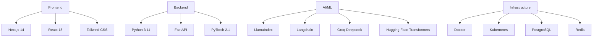
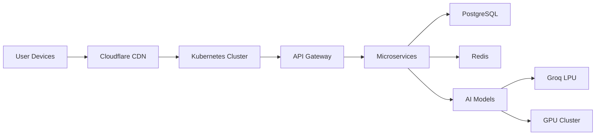

# Technical Context

## Technology Stack

## Development Environment

- Python 3.11.6
- Node.js 18.17.1
- Docker 24.0.6
- Kubernetes 1.28
- Git 2.42.0
- VS Code 1.83

## Deployment Architecture

## Technical Constraints

1. Compliance Requirements
   - HIPAA compliance for patient data
   - GDPR for European users
   - ISO 27001 certification
   - Data encryption at rest and in transit

2. Performance Requirements
   - < 500ms response time for API calls
   - 99.99% uptime SLA
   - Concurrent user support: 10,000+

3. Accuracy Requirements
   - 95%+ accuracy for wound detection
   - < 2% false positive rate
   - Continuous model improvement

## Key Dependencies

### AI/ML Frameworks
- LlamaIndex v0.8.12
- Langchain v0.0.342
- PyTorch 2.1.0
- Hugging Face Transformers 4.34.0

### Infrastructure
- Docker 24.0.6
- Kubernetes 1.28
- PostgreSQL 15.4
- Redis 7.2.0

### Integration APIs
- WhatsApp Business API v2.45
- HL7/FHIR API v4.0.1
- DICOM Web Services
- Pharmacy Integration API

## Development Workflows

1. CI/CD Pipeline
   - Automated testing with pytest
   - Code quality checks with SonarQube
   - Container image scanning with Trivy
   - Blue/Green deployments

2. Version Control
   - Git flow branching model
   - Semantic versioning
   - Code reviews via GitHub PRs
   - Automated changelog generation

3. Monitoring
   - Prometheus for metrics
   - Grafana for visualization
   - ELK stack for logging
   - Sentry for error tracking

## Related Files
- systemPatterns.md: System architecture and patterns
- productContext.md: User needs and solution overview
- progress.md: Implementation status and milestones
