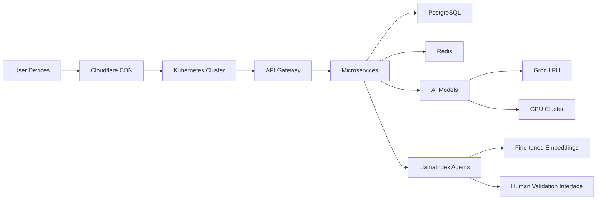

# Technical Context

## Technology Stack

```mermaid
graph TD
    A[Frontend] --> B[Next.js 14]
    A --> C[React 18]
    A --> D[Tailwind CSS]
    
    E[Backend] --> F[Python 3.11]
    E --> G[FastAPI]
    E --> H[PyTorch 2.1]
    
    I[AI/ML] --> J[LlamaIndex]
    I --> K[Langchain]
    I --> L[Groq Deepseek]
    I --> M[Hugging Face Transformers]
    
    N[Infrastructure] --> O[Docker]
    N --> P[Kubernetes]
    N --> Q[PostgreSQL]
    N --> R[Redis]
    
    S[LlamaIndex Components] --> T[Multi-Agent Framework]
    S --> U[Fine-tuned Embeddings]
    S --> V[Human-in-the-Loop Workflows]
    S --> W[Streaming Capabilities]
```



## Development Environment

- Python 3.11.6
- Node.js 18.17.1
- Docker 24.0.6 (for production)
- Kubernetes 1.28
- Git 2.42.0
- VS Code 1.83
- Python Virtual Environment (venv) for LlamaIndex development

## LlamaIndex Development Environment Setup (New)

```bash
# Crear entorno virtual para LlamaIndex
python -m venv /Users/autonomos_dev/Projects/pressure\ System/venv-llamaindex

# Activar el entorno virtual
source /Users/autonomos_dev/Projects/pressure\ System/venv-llamaindex/bin/activate

# Instalar dependencias principales
pip install llama-index==0.11.4 python-dotenv

# Instalar dependencias para embeddings
pip install sentence-transformers

# Instalar dependencias para procesamiento de imágenes
pip install torch torchvision pillow

# Instalar dependencias para integración con APIs
pip install fastapi uvicorn websockets
```

## Deployment Architecture



## Technical Constraints

1. Compliance Requirements
   - HIPAA compliance for patient data
   - GDPR for European users
   - ISO 27001 certification
   - Data encryption at rest and in transit

2. Performance Requirements
   - < 500ms response time for API calls
   - 99.99% uptime SLA
   - Concurrent user support: 10,000+

3. Accuracy Requirements
   - 95%+ accuracy for wound detection
   - < 2% false positive rate
   - Continuous model improvement

## Key Dependencies

### AI/ML Frameworks
- LlamaIndex v0.11.4 (Updated)
- Langchain v0.0.342
- PyTorch 2.1.0
- Hugging Face Transformers 4.34.0

### LlamaIndex Components (New)
- finetune-embedding: For specialized medical embeddings
- human_in_the_loop_workflow_demo: For clinical validation workflows
- multi-agents-workflow: For agent orchestration
- python-agents-tutorial: For agent implementation patterns
- create_llama_projects: For reference implementations
- llama-datasets: For evaluation datasets

### Infrastructure
- Docker 24.0.6 (for production)
- Kubernetes 1.28
- PostgreSQL 15.4
- Redis 7.2.0
- Python Virtual Environment (venv) for development

### Integration APIs
- WhatsApp Business API v2.45
- HL7/FHIR API v4.0.1
- DICOM Web Services
- Pharmacy Integration API

## LlamaIndex Implementation Details (New)

### 1. Fine-tuned Embeddings for Medical Domain

```python
from sentence_transformers import SentenceTransformer, losses
from torch.utils.data import DataLoader
from sentence_transformers.evaluation import EmbeddingSimilarityEvaluator

# Cargar modelo base
model = SentenceTransformer('BAAI/bge-small-en')

# Preparar datos de entrenamiento
train_examples = [
    InputExample(texts=['¿Cuáles son los signos de una úlcera por presión?', 'Los signos incluyen enrojecimiento, dolor y cambios en la textura de la piel.'], label=1.0),
    InputExample(texts=['¿Cómo prevenir las LPP?', 'La prevención incluye cambios posturales frecuentes y uso de superficies especiales.'], label=1.0),
    # Más ejemplos...
]

# Configurar entrenamiento
train_dataloader = DataLoader(train_examples, shuffle=True, batch_size=16)
train_loss = losses.CosineSimilarityLoss(model)

# Entrenar modelo
model.fit(
    train_objectives=[(train_dataloader, train_loss)],
    epochs=10,
    evaluation_steps=100,
    warmup_steps=100,
    output_path='models/medical-embeddings'
)
```

### 2. Multi-Agent Workflow Implementation

```python
from llama_index.workflow import Workflow
from llama_index.agent import AgentRunner

# Definir agentes especializados
image_agent = create_image_analysis_agent()
risk_agent = create_risk_assessment_agent()
treatment_agent = create_treatment_recommendation_agent()

# Crear flujo de trabajo
lpp_workflow = Workflow()

# Definir nodos
image_node = lpp_workflow.add_node("image_analysis", image_agent.run)
risk_node = lpp_workflow.add_node("risk_assessment", risk_agent.run)
treatment_node = lpp_workflow.add_node("treatment", treatment_agent.run)

# Definir conexiones
lpp_workflow.add_edge(image_node, risk_node)
lpp_workflow.add_edge(risk_node, treatment_node)

# Ejecutar flujo de trabajo
result = lpp_workflow.run(query="Analyze this pressure wound image")
```

### 3. Human-in-the-Loop Validation

```python
from llama_index.core.workflow import HITLWorkflow
from llama_index.core.workflow.base import InputRequiredEvent, ProgressEvent
from fastapi import FastAPI, WebSocket
import asyncio

app = FastAPI()

class LPPValidationWorkflow(HITLWorkflow):
    async def execute_workflow(self, query):
        # Análisis inicial
        yield ProgressEvent(message="Analyzing wound image...")
        analysis = await self.analyze_image(query)
        
        # Solicitar validación
        yield InputRequiredEvent(
            message="Please validate this analysis",
            payload=analysis
        )
        
        # Esperar respuesta
        human_response = await self.wait_for_human_input()
        
        # Procesar con validación
        if human_response.is_approved:
            return await self.generate_treatment_plan(analysis, human_response.feedback)
        else:
            return await self.reanalyze(analysis, human_response.feedback)

@app.websocket("/ws")
async def websocket_endpoint(websocket: WebSocket):
    await websocket.accept()
    query = await websocket.receive_text()
    
    workflow = LPPValidationWorkflow()
    async for event in workflow.astream(query):
        await websocket.send_json(event.dict())
        
        if isinstance(event, InputRequiredEvent):
            human_response = await websocket.receive_json()
            workflow.add_human_response(human_response)
```

### 4. RAG Evaluation with LlamaDatasets

```python
from llama_index.llama_dataset import LabelledRagDataset
from llama_index.llama_pack import download_llama_pack

# Crear dataset de evaluación
lpp_dataset = LabelledRagDataset(
    queries=[
        "¿Cuáles son los primeros signos de una úlcera por presión?",
        "¿Cómo se debe posicionar a un paciente con riesgo alto de LPP?",
        # Más preguntas...
    ],
    relevant_docs=[
        ["Los primeros signos incluyen enrojecimiento persistente, cambios en la textura..."],
        ["El posicionamiento adecuado incluye elevación de talones, uso de almohadas..."],
        # Documentos relevantes...
    ],
    reference_responses=[
        "Los primeros signos de una úlcera por presión incluyen...",
        "Para posicionar correctamente a un paciente con alto riesgo...",
        # Respuestas de referencia...
    ]
)

# Evaluar sistema RAG
RagEvaluatorPack = download_llama_pack("RagEvaluatorPack")
evaluator = RagEvaluatorPack(
    rag_dataset=lpp_dataset,
    query_engine=lpp_query_engine
)
results = evaluator.run()
```

## Development Workflows

1. CI/CD Pipeline
   - Automated testing with pytest
   - Code quality checks with SonarQube
   - Container image scanning with Trivy
   - Blue/Green deployments

2. Version Control
   - Git flow branching model
   - Semantic versioning
   - Code reviews via GitHub PRs
   - Automated changelog generation
   - MCP Git server for repository analysis

3. Monitoring
   - Prometheus for metrics
   - Grafana for visualization
   - ELK stack for logging
   - Sentry for error tracking

## Environment Management (New)

1. Development Environment
   - Python Virtual Environment (venv) for LlamaIndex development
   - Local development with hot reloading
   - Environment variable management with dotenv
   - Separate environments for different components

2. Testing Environment
   - Containerized testing with Docker
   - Isolated test databases
   - Mock services for external dependencies

3. Production Environment
   - Kubernetes orchestration
   - Horizontal pod autoscaling
   - High availability configuration

## Environment Decision Rationale (New)

After careful analysis, we have decided to use Python virtual environments (venv) for LlamaIndex development instead of Docker containers for the following reasons:

1. **Development Speed**
   - Faster iteration cycles with direct file system access
   - No container build/restart overhead
   - Easier debugging with direct access to processes

2. **Integration with LlamaIndex**
   - LlamaIndex examples and tutorials use virtual environments
   - Better compatibility with Python-native dependencies
   - Simplified access to GPU resources for model training

3. **Dependency Management**
   - More granular control over package versions
   - Easier to update individual dependencies
   - Better isolation between different components

4. **Hybrid Approach**
   - Use venv for development
   - Use Docker for testing and production
   - Maintain consistent deployment with Kubernetes

## Related Files
- systemPatterns.md: System architecture and patterns
- productContext.md: User needs and solution overview
- progress.md: Implementation status and milestones
- activeContext.md: Current development focus
